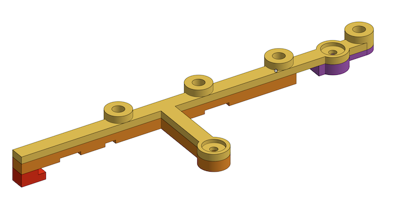
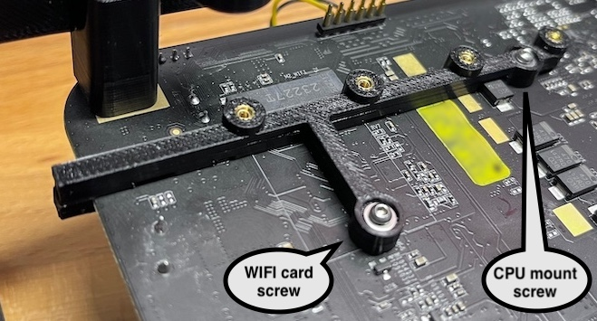

# DXP480T NVMe Bracket

3D printable bracket for securing the NVMe drives of the DXP480T, when running without the case.



## Required Parts

```
4 x M2 threaded inserts
2 x M2 6mm bolt
2 x M2 washer (optional)
Glue (to assemble the bracket parts)
```

## Print Recommendations

Recommend printing using a 0.2mm or 0.4mm nozzel. The part should be solid, so set wall loops appropriately to avoid infill.

The DXP480T gets hot. Strongly recommend printing with an appropriately high-temp material -- ABS, ASA, or better.  Do NOT use PLA or PETG as these will likely melt or deform in use.

## Installation

Use a suitable glue to assemble the bracket. For ABS, use plastic model kit type plastic cement. 

Install the 4 threaded inserts using a hot soldering iron or other suitable tool.

The bracket currently assumes you're not using the wifi card: remove it to gain access to the wifi card screw hole.  Also remove the indicated cpu mount rear screw.  

The bracket attaches using these two vacated screw holes, as well as cliping over the edge of the motherboard.  Notching in the bracket should clear all motherboard components.

Use only 6mm M2 bolts to screw the bracket to the motherboard - longer screws may interfere with the CPU cooler.





